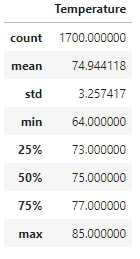
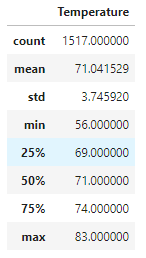

# Surfs Up Anlysis 

## Overview of the statistical analysis:

The purpose of the analysis was to compare temperature data for both June and December to determine whether temperature could impact future profit. 

## Results:
Below are the two summary charts for each June and December. This shows all the temperature data for these two months from the stations. 

June Statistical Data 

December Statistical Data

There are some major differences betweeen the data acquired for June and December 

- The range of temperateure was significantly larger in the December data. The low in December was 56 which is 8 deg lower than the low in June. 
- There was 183 more temperature readings in June than December. 
- When looking at the percentiles for each month, we can see that the december data shows 75% of hte data is between 69-74 deg F. For June, the temperature was  between 73-77 deg for 75% of the findings. 

## Summary:

Overall, the data is similar enough between the months to potentially not have an impact on sales. Some other queries we could do, would be to look at the station table to ensure that there is enough mapped from each station to ensure coverage. Another analysis would be to overlay the precipitation and temperature tables. Is there any correlation or data point that stands out that would be cause for concern? 

The data in itself does not show any major issues, but it would be important to analyze outside factors. Some other possibilities would be:

- Are there any similar shops in the near by area? 
- How long have they been around? If not long, is there a trend to their closing? 
- Does Temperature/Precipitation correlate to those closings? 

Analyzing all these factors together would allow us to determine if it would be profitable to open up this shop. It would definitely have factors outside of straight temperature or only of one factor. We would have to look at them all together to come up with a better analysis. 

